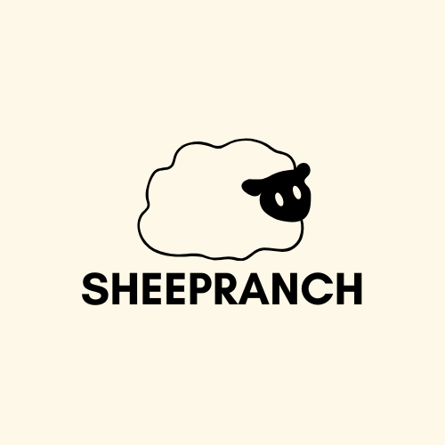
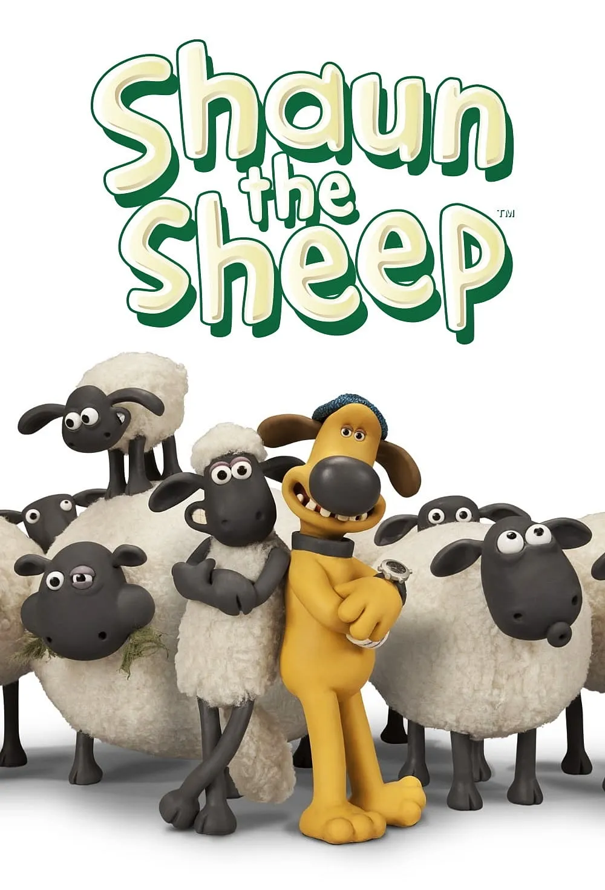
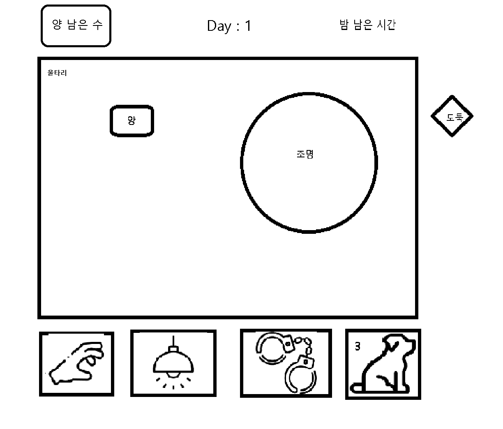

# 프로젝트명: SheepRanch

# [목차]

1. [컨셉](#컨셉)
2. [관련 이미지](#관련-이미지)
3. [대표 이미지](#대표-이미지)
4. [대표이미지 기반 작품묘사](#대표이미지-기반-작품묘사)
5. [SheepRanch 구성요소](#SheepRanch구성요소)
6. [게임 시스템 디자인](#게임-시스템-디자인)
7. [스토리보드](#스토리보드)
8. [요구사항](#요구사항)
9. [개발작업 일정](#개발작업-일정)

# [컨셉]
## 메인컨셉 : 디펜스
기존의 디펜스 게임이 외부의 적을 막아내는 방식이라면, 이 게임은 양들이 울타리 밖으로 나가지 못하도록 지키는 것이 핵심입니다.

### 서브 컨셉 1 : 간단한 조작
조작은 마우스를 기본으로 사용하지만 q,w,e,r 버튼을 통해 빠르게 다른 모드로 전환할 수 있습니다.

### 서브 컨셉 2 : 밤
게임의 시간은 밤이며, 어두운 맵을 조명으로 밝혀가며 양들을 찾아야 합니다.

### 서브 컨셉 3 : 조명
조명을 한 번 움직인 후에는 일정 시간 동안 조작할 수 없습니다. 이는 게임의 난이도를 높이는 요소가 될 것입니다.

### 서브 컨셉 4 : 도둑
도둑은 울타리 밖에서 등장하여 양을 훔쳐갑니다. 양을 잃지 않도록 조심합시다.

### 서브 컨셉 5 : 강아지
강아지는 양의 움직임을 잠시 멈추는 역할을 합니다. 하지만 일정 횟수를 사용하면 더 이상 사용할 수 없습니다.

  

# [관련 이미지]

- 이미지  
  
  이 게임은 "Shaun the Sheep" 이라는 애니메이션을 보고 영감을 받아 제작하게 되었습니다.

  

# [대표 이미지]

  

# [대표이미지 기반 작품묘사]

### 대표이미지 기반
> 게임 좌상단에는 울타리 안에 있는 양의 수가 표시되며, 우상단에는 게임이 끝나는 시간이 표시된다. 시간이 0이 되기 전에 양이 먼저 0이 되면 게임오버된다.
  
양은 울타리 안에 위치하여 상태에 따라서 제자리에 멈추거나 밖으로 이동한다. 울타리 근처에 도달하면 양은 울타리를 넘으며 남은 양의 수를 줄인다.
  
조명 위치 안에 있는 것들만 상호작용 할 수 있다.
기본적으로 중앙을 비춰주는 조작 불가능한 조명이 하나 존재하고, 마우스 클릭 시 잠시 주위를 비춰주는 조명이 있다.
  
도둑은 밖에서 안으로 이동하며 양을 훔쳐 도망간다.
  
게임 하단에는 사용자 모드를 변경할 수 있는 버튼이 있으며, 마우스 클릭으로 조작할 수 있다.
  
처음에 있는 손 모양 버튼이 눌린 상태로 양을 클릭하면 양을 집을 수 있다.
  
두번째로 있는 조명 버튼이 눌린 상태로 바닥을 누르면 조명이 해당 위치로 이동한다.
  
세번째에 있는 수갑 버튼이 눌린 상태로 도둑을 누르면 도둑이 체포되어 사라진다.
  
네번째에 있는 강아지 버튼이 눌린 상태로 바닥을 누르면 횟수가 줄어들며 양들이 멈춘다.
  
각 버튼은 q,w,e,r 버튼을 통해 빠르게 변경하는 것이 가능하다.

# [SheepRanch구성요소]

## 1. 메커니즘
[도전 과제]

1. 제한시간 안에 최대한 많은 양을 울타리 안에 가둬두기
2. 3일을 버텨 엔딩을 본다.

[재미 요소]
1. 제한시간 내 양을 보호하는 디펜스적 요소
2. 날이 지남에 따라 변하는 난이도
3. 조명으로 인한 조작 범위 제한
 

## 2. 이야기

[만들게 된 배경]  
기존의 디펜스 게임은 밖에서 안으로 침입하는 적을 방어하는 구조라면 반대로 동작하면 어떨까 라는 생각에서 시작되었고, 어릴 적 재미있게 봤던 애니메이션에서 봤던 장난기 넘치고 익살스러운 캐릭터에서 영감을 받아 제작하게 되었습니다.

[게임 줄거리]
지인의 부탁으로 3일 동안 양을 돌보게 되었다. 어쩐 일인지 밤만 되면 양들이 도망다닌다.
첫째날은 문제없이 지나갔다.
둘째날은 조명이 꺼졌다.
셋째날은 양들이 살이 빠지면서 빨라졌다.
 

## 3. 기술

Unity의 2D light기능을 이용해서 조명을 구현할 생각입니다.

# [게임 시스템 디자인]

## 1. 게임 오브젝트 분해

|연번|오브젝트 이름|오브젝트 이미지|
|:--:|:----------:|:------------:|
|1|sheep||
|2|light||
|3|fence||
|4|thief||
|5|dog||
|6|controller||

## 2. 파라미터
### 1) 오브젝트 이름: sheep

|속성|영문명칭|설명|
|:--:|:-----:|:--:|
|상태|state|sheep의 상태를 구분하는 변수|
|이동속도|speed|sheep이 이동할 속도|
|방향|dir|양이 이동할 방향|
### 2) 오브젝트 이름: light
|속성|영문명칭|설명|
|:---:|:---:|:---:|
|상태|state|꺼졌는지 켜졌는지를 나타내는 속성|
|빛의 세기|intensity|조명 원의 크기|
### 3) 오브젝트 이름: fence
|속성|영문명칭|설명|
|:---:|:---:|:---:|
|상태|state|양이 닿았는지 확인하는 속성|
|울타리 안에 있는 sheep의 수|fenceInCount|울타리 안의 sheep을 계산하기 위한 변수|
|울타리 밖에 있는 sheep의 수|fenceOutCount|울타리 밖의 sheep을 계산하기 위한 변수|
### 4) 오브젝트 이름: thief
|속성|영문명칭|설명|
|:---:|:---:|:---:|
|상태|state|양을 훔치러 가는지, 훔치고 달아나는 중인지 나타내는 속성|
|이동속도|speed|thief의 이동속도|
|방향|dir|thief의 방향|
### 5) 오브젝트 이름: dog
|속성|영문명칭|설명|
|:-:|:---:|:---:|
|사용가능횟수|count|양을 멈출 수 있는 횟수|
### 6) 오브젝트 이름: controller
|속성|영문명칭|설명|
|:---:|:---:|:---:|
|모드|mode|현재 눌린 버튼에 따른 상태를 나타내는 변수|

## 3. 행동 뽑아보기
### 1) 오브젝트 이름: sheep
|행동|영문명칭|설명|
|:-:|:-:|:-:|
|이동|move|sheep을 이동시킨다|
|상태변경|changeState|sheep 상태를 변경한다|
|방향변경|changeDir|방향을 변경한다|
|생성|create|sheep 오브젝트를 생성한다|
|삭제|delete|sheep 오브젝트를 삭제한다|
### 2) 오브젝트 이름: light
|행동|영문명칭|설명|
|:-:|:-:|:-:|
|상태변경|changeState|light 상태를 변경한다|
|크기변경|changeIntensity|원의 반경을 변경한다|
|생성|create|light 오브젝트를 생성한다|
|삭제|delete|light 오브젝트를 삭제한다|
### 3) 오브젝트 이름: fence
|행동|영문명칭|설명|
|:-:|:-:|:-:|
|상태변경|changeState|fence 상태를 변경한다|
|sheep의 수 변경|changeCount|탈출한 sheep을 계산한다|
### 4) 오브젝트 이름: thief
|행동|영문명칭|설명|
|:-:|:-:|:-:|
|이동|move|thief를 이동시킨다|
|상태변경|changeState|thief 상태를 변경한다|
|방향변경|changeDir|thief 방향을 변경한다|
|생성|create|thief 오브젝트를 생성한다|
|삭제|delete|thief 오브젝트를 삭제한다|
### 5) 오브젝트 이름: dog
|행동|영문명칭|설명|
|:-:|:-:|:-:|
|짖다|bark|울타리 안에 있는 모든 sheep을 멈춤 상태로 변경한다.|
|생성|create|dog 오브젝트를 생성한다|
|삭제|delete|dog 오브젝트를 삭제한다|
### 6) 오브젝트 이름: controller
|행동|영문명칭|설명|
|:-:|:-:|:-:|
|모드변경|changeMode|현재 모드 변경|
|모드실행|executeMode|모드에 해당하는 동작 수행|

## 4. 상태 뽑아보기
### 1) 오브젝트 이름 : sheep
|상태|영문명칭|설명|
|:-:|:-:|:-:|
|멈춤||
|이동||
|플레이어에게 잡힘||
|도둑에게 잡힘||

## 5. 게임의 규칙
### 1) 핵심 규칙
### 2) 보조 규칙

# [스토리보드]

# [요구사항]
## 게임 화면 구성
### 플레이어 조작
### 애니메이션
### 충돌처리
### UI
### 카메라
### 게임매니저

---
### 씬 구성 및 이동

# [개발작업 일정]

## 1주차
#### 게임 화면 구성

## 2주차
#### 플레이어 조작

## 3주차
#### 애니메이션
#### 충돌처리

## 4주차
#### UI

## 5주차

## 6주차
